# Hyperlane LSP7 version - `HypLSP7` [![Open in Gitpod][gitpod-badge]][gitpod] [![Github Actions][gha-badge]][gha] [![Foundry][foundry-badge]][foundry] [![License: MIT][license-badge]][license]

[gitpod]: https://gitpod.io/#https://github.com/lukso-network/lsp-bridge-HypLSP7
[gitpod-badge]: https://img.shields.io/badge/Gitpod-Open%20in%20Gitpod-FFB45B?logo=gitpod
[gha]: https://github.com/lukso-network/lsp-bridge-HypLSP7/actions
[gha-badge]: https://github.com/lukso-network/lsp-bridge-HypLSP7/actions/workflows/ci.yml/badge.svg
[foundry]: https://getfoundry.sh/
[foundry-badge]: https://img.shields.io/badge/Built%20with-Foundry-FFDB1C.svg
[license]: https://opensource.org/licenses/MIT
[license-badge]: https://img.shields.io/badge/License-MIT-blue.svg

This repo is the LSP7 version of the [`HypERC20`] and [`HypERC20Collateral`] of `@hyeperlane-xyz/core` package. They are used to bridge tokens between the Ethereum and LUKSO chains using the [Hashi Bridge](https://crosschain-alliance.gitbook.io/hashi).

## Architecture & Workflow

The flow for bridging tokens is generally as follow. If the token is originally from:

### ETHEREUM -> LUKSO

**scenario 1:** the ERC20 token initially exists on Ethereum and was deployed there (_e.g: DAI, USDC, etc...).

The ERC20 token is locked on ETHEREUM, an HypLSP7 token is minted on LUKSO.

```mermaid
%% Ethereum -> LUKSO - Bridge an existing ERC20 on Ethereum to LUKSO
%% example: DAI
graph TD
    subgraph Source_Chain_Ethereum[Ethereum]
        User[User 👤] -->|transfer ➡️| ERC20
        ERC20 -->|lock 🔒| HypERC20Collateral
    end
        HypERC20Collateral .->|Bridging| HypLSP7
    subgraph Destination_Chain_LUKSO[LUKSO]
        HypLSP7 -->|mint ⛏️| End_User
        End_User[User 👤]
    end
```



**scenario 2:** the token was migrated from LUKSO to Ethereum and an HypERC20 token contract was created as a wrapper on the Ethereum side.

```mermaid
%% Ethereum -> LUKSO - LSP7 token that was initially bridged from LUKSO
%% example: Chillwhale
graph TD
    subgraph Source_Chain_Ethereum[Ethereum]
        User[User 👤] -->|burn 🔥| HypERC20
        HypERC20[HypERC20]
    end
        HypERC20[HypERC20] .->|bridging| HypLSP7Collateral
    subgraph Destination_Chain_LUKSO[LUKSO]
        HypLSP7Collateral -->|unlock 🔓 + transfer| LSP7
    end
```



### LUKSO -> ETHEREUM

- **scenario 3:** the LSP7 token was originally created and deployed on LUKSO.

The LSP7 token is transferred to a `HypLSP7Collateral` contract on LUKSO where it is locked. The HypERC20 token on Ethereum is then minted for the user.

```mermaid
graph TD
    subgraph Source_Chain_LUKSO[LUKSO]
        User[User 👤] -->|transfer ➡️| LSP7
        LSP7 -->|transfer + lock 🔒| HypLSP7Collateral
    end
        HypLSP7Collateral .->|bridging| HypERC20

    subgraph Destination_Chain_Ethereum[Ethereum]
        HypERC20 -->|mint ⛏️| End_User
        End_User[User 👤]
    end
```



- **scenario 4:** an ERC20 token was bridged from Ethereum to LUKSO and we want to bridge back to Ethereum.

This HypLSP7 token is burnt on LUKSO, on Ethereum it is unlocked.

```mermaid
graph TD
    subgraph Source_Chain_LUKSO[LUKSO]
        User[User 👤] -->|burn 🔥| HypLSP7
        HypLSP7[HypLSP7]
    end
        HypLSP7 .->|bridging| HypERC20Collateral

    subgraph Destination_Chain_Ethereum[Ethereum]
        HypERC20Collateral -->|unlock 🔓| LSP7
        LSP7 -->|transfer ➡️| End_User[User 👤]
    end
```




## Complete Diagrams

### Ethereum -> LUKSO


**on Ethereum chain**

1. User transfer ERC20 tokens to [`HypERC20Collateral`]. This locks the tokens in the collateral contract.
2. `HypERC20Collateral` contract call [`Mailbox`] to pass the message.
3. The `Mailbox` calls:
   - 3.1. the default Hook (created by Hyperlane),
   - 3.2. and the Hashi Hook (created by CCIA team).
5. Hashi Hook dispatch the token relaying message from `Yaho` contracts.

> In the architecture diagram above:
> - The `Yaho` contracts handle the dispatching and batching of messages across chains.
> - The `Yaru` contracts ensures that the messages are properly executed on the destination chain by calling relevant functions like `onMessage`.

**Off chain**

5. Hashi relayer (managed by CCIA team) listen for events from `Yaho` contracts and request the reporter contracts to relay token relaying message.
6. Hashi executor (managed by CCIA team) listen to event from each Hashi adapter contracts and call `Yaru.executeMessages`. **This step checks whether the Hashi adapters agree on a specify message id** (a threshold number of hash is stored), and set the message Id to verified status.
7. Validator (run by Hyperlane & LUKSO team) will sign the Merkle root when new dispatches happen in Mailbox.
8. Hyperlane relayer (run by Hyperlane team) relays the message by calling Mailbox.process().

**on LUKSO chain**

8. When [`Mailbox.process(...)`](https://github.com/hyperlane-xyz/hyperlane-monorepo/blob/3d116132b87d36af9576d6b116f31a53d680db4a/solidity/contracts/Mailbox.sol#L188-L197) is called, it will:
  - 8.1. check with Multisig ISM (includes Hashi ISM), whether the message is signed by validators & verified by Hashi ISM.
  - 8.2. If so, it will mint [HypLSP7](./src/HypLSP7.sol) tokens to the receiver.


### LUKSO -> Ethereum


**on LUKSO chain**

> _Step 1 to 3 needs to be confirmed_

1. User transfer LSP7 token to HypLSP7 contract and the tokens are burnt.
2. HypLSP7 contract calls `Mailbox` to pass the message.
3. `Mailbox` calls Default Hook (created by Hyperlane) and Hashi Hook (created by CCIA team).
4. Hashi Hook dispatch the token relaying message from Yaho contracts.

**Off chain**

4. Off chain process remains the same as before, _except there is no Light Client support for Hashi from LUKSO → Ethereum_.

**on Ethereum chain**

5. When `Mailbox.process()` is called:
   - 5.1. it will check with Multisig ISM (includes Hashi ISM), whether the message is signed by validators & verified by Hashi ISM.
   - 5.2. If so, it will unlock ERC20 token to the receiver on the Ethereum chain.


### Examples of bridged tokens

- ETH -> LUKSO: https://explorer.hyperlane.xyz/message/0x53a383e32fdb68748c8af5c86be3669e58eadc377db2a9f420826cb9474dd55c

- LUKSO -> ETH: https://explorer.hyperlane.xyz/message/0xf9c86a22e7b5584fc87a9d4ffc39f967a8745cd28b98ed2eaeb220c43996c4ca


### Relevant links & resources

- [Cross Chain Alliance - Hashi](https://crosschain-alliance.gitbook.io/hashi)
- [Hyperlane smart contracts monorepo](https://github.com/hyperlane-xyz/hyperlane-monorepo)

## Getting Started

This project is based on the Foundry template by PaulRBerg.

```sh
bun install # install Solhint, Prettier, and other Node.js deps
```

If this is your first time with Foundry, check out the
[installation](https://github.com/foundry-rs/foundry#installation) instructions.

### Installing Dependencies

Foundry typically uses git submodules to manage dependencies, but this template uses Node.js packages because
[submodules don't scale](https://twitter.com/PaulRBerg/status/1736695487057531328).

This is how to install dependencies:

1. Install the dependency using your preferred package manager, e.g. `bun install dependency-name`
   - Use this syntax to install from GitHub: `bun install github:username/repo-name`
2. Add a remapping for the dependency in [remappings.txt](./remappings.txt), e.g.
   `dependency-name=node_modules/dependency-name`

Note that OpenZeppelin Contracts is pre-installed, so you can follow that as an example.


### Sensible Defaults

This template comes with a set of sensible default configurations for you to use. These defaults can be found in the
following files:

```text
├── .editorconfig
├── .gitignore
├── .prettierignore
├── .prettierrc.yml
├── .solhint.json
├── foundry.toml
└── remappings.txt
```


## Usage

This is a list of the most frequently needed commands.

### Build & Compile


```sh
# Build the contracts:
forge build

# Delete the build artifacts and cache directories:
forge clean

# Get a test coverage report:
forge coverage

# Format the contracts:
forge fmt

# Get a gas report:
forge test --gas-report

# Lint the contracts:
bun run lint

# Run the tests:
forge test

# Generate test coverage and output result to the terminal:
bun run test:coverage

# Generate test coverage with lcov report (you'll have to open the `./coverage/index.html` file in your browser,
# to do so simply copy paste the path):
bun run test:coverage:report
```

### GitHub Actions

This repository uses pre-configured GitHub Actions. The contracts are linted and tested on every push and pull requests.

You can edit the CI script in [.github/workflows/ci.yml](./.github/workflows/ci.yml).


## Foundry Resources

This template builds upon the frameworks and libraries mentioned above, so please consult their respective documentation for details about their specific features.

For example, if you're interested in exploring Foundry in more detail, you should look at the
[Foundry Book](https://book.getfoundry.sh/). In particular, you may be interested in reading the
[Writing Tests](https://book.getfoundry.sh/forge/writing-tests.html) tutorial.


[`HypERC20Collateral`]: https://github.com/hyperlane-xyz/hyperlane-monorepo/blob/%40hyperlane-xyz/core%405.2.0/solidity/contracts/token/HypERC20Collateral.sol
[`HypERC20`]: https://github.com/hyperlane-xyz/hyperlane-monorepo/blob/%40hyperlane-xyz/core%405.2.0/solidity/contracts/token/HypERC20.sol
[`Mailbox`]: https://github.com/hyperlane-xyz/hyperlane-monorepo/blob/%40hyperlane-xyz/core%405.2.0/solidity/contracts/Mailbox.sol
