```mermaid
%% Ethereum -> LUKSO - Bridge an existing ERC20 on Ethereum to LUKSO
%% example: DAI
graph TD
    subgraph Source_Chain_Ethereum[Ethereum]
        User[User 👤] -->|transfer ➡️| ERC20
        ERC20 -->|lock 🔒| HypERC20Collateral
    end
        HypERC20Collateral .->|Bridging| HypLSP7
    subgraph Destination_Chain_LUKSO[LUKSO]
        HypLSP7 -->|mint ⛏️| End_User
        End_User[User 👤]
    end
```

```mermaid
graph TD
    subgraph Source_Chain_LUKSO[LUKSO]
        User[User 👤] -->|transfer ➡️| LSP7
        LSP7 -->|transfer + lock 🔒| HypLSP7Collateral
    end
        HypLSP7Collateral .->|bridging| HypERC20

    subgraph Destination_Chain_Ethereum[Ethereum]
        HypERC20 -->|mint ⛏️| End_User
        End_User[User 👤]
    end
```

```mermaid
graph TD
    subgraph Source_Chain_LUKSO[LUKSO]
        User[User 👤] -->|burn 🔥| HypLSP7
        HypLSP7[HypLSP7]
    end
        HypLSP7 .->|bridging| HypERC20Collateral

    subgraph Destination_Chain_Ethereum[Ethereum]
        HypERC20Collateral -->|unlock 🔓| LSP7
        LSP7 -->|transfer ➡️| End_User[User 👤]
    end
```

# Bridging Flow Overview

The flow for bridging tokens between Ethereum and LUKSO using Hyperlane involves locking tokens on a source chain, relaying the transaction via Hyperlane's messaging protocol (a relayer listens to a `Mailbox`), and minting/unlocking tokens on the destination chain.

```mermaid
graph LR;
    User[User 👤] --> ERC20[ERC20 stablecoin 🪙];
    subgraph Collateral_Chain[Ethereum]
        ERC20 -- lock tokens into --> HypERC20Collateral[HypERC20Collateral 🏦🔒];
        HypERC20Collateral -- informs --> Mailbox1[Hyperlane Mailbox 📭📥];
    end
    Mailbox1 -- to relay ✉️ bridge token --> Relayer[Hyperlane Relayer 🚚];
    Relayer -- relaying ✉️ bridge tx to LUKSO chain  --> Mailbox2[Hyperlane Mailbox 📬📤];

    subgraph Synthetic_Chain[LUKSO]
        Mailbox2 -- verify bridge transaction in source chain;
        Mailbox2 --> HypLSP7[wrapped synthetic version of stablecoin as LSP7 🪙 📦];
    end
        HypLSP7 -- mint ⛏️ --> User2[User 👤]
```



If the token is originally from:

## ETHEREUM -> LUKSO

### Scenario 1: ERC20 on Ethereum (USDC) -> HypLSP7 on LUKSO

The ERC20 token initially exists on Ethereum and was deployed there (_e.g.: DAI, USDC, etc._). The ERC20 token is locked on ETHEREUM, an HypLSP7 token is minted on LUKSO.



### Scenario 2: HypERC20 from Ethereum (wCHILL) -> LSP7 on LUKSO

The token was migrated from LUKSO to Ethereum and an `HypERC20` token contract was created as a wrapper on the Ethereum side (_e.g.: wrapped CHILL or wrapped FABS as `HypERC20`_). The user burns the wrapped token `HypERC20` on Ethereum, and the tokens are unlocked from the `HypLSP7Collateral` contract on LUKSO and transferred back to the user.

```mermaid
%% Ethereum -> LUKSO - LSP7 token that was initially bridged from LUKSO
%% example: CHILL
graph TD
    subgraph Source_Chain_Ethereum[Ethereum]
        User[User 👤] -->|burn 🔥| HypERC20
        HypERC20[HypERC20]
    end
        HypERC20[HypERC20] .->|bridging| HypLSP7Collateral
    subgraph Destination_Chain_LUKSO[LUKSO]
        HypLSP7Collateral -->|unlock 🔓 + transfer| LSP7
    end
```



## LUKSO -> ETHEREUM

### Scenario 3: LSP7 on LUKSO (CHILL) -> HypERC20 on Ethereum

The LSP7 token was originally created and deployed on LUKSO (_e.g.: CHILL, FABS, etc._). The user transfers the LSP7 token to its `HypLSP7Collateral` contract on LUKSO where it is locked. On Ethereum, tokens are minted to the user in the form of `HypERC20` synthetic tokens.



### Scenario 4: HypLSP7 on LUKSO (wUSDC) -> ERC20 on Ethereum

An `ERC20` token was bridged from Ethereum to LUKSO and we want to bridge back to Ethereum (_e.g.: wrapped DAI as `HypLSP7`_). This HypLSP7 token is burnt on LUKSO, on Ethereum it is unlocked.



## Bridge Transactions Flow (Detailed)

### Ethereum -> LUKSO

> **Note:** The detailed transaction flow below corresponds to the [**scenario 1**](#ethereum---lukso) above. Where an ERC20 token that initially exists on Ethereum (_e.g.: DAI, USDC, etc._) is bridged to LUKSO.

**On Ethereum chain**

1. User approves `HypERC20Collateral` contract to spend a certain amount of ERC20 tokens.
   ```solidity
   HypERC20.approve(address spender, uint256 amount)
   ```
2. User calls `transferRemote(...)` on `HypERC20Collateral` to pass the message via the `Mailbox`, locking the tokens in the collateral contract.
   ```solidity
   transferRemote(
       uint32 destination, // chain ID
       address recipient,
       uint256 amount
   )
   ```
3. Internally, `__Router_dispatch(...)` and `mailbox.dispatch(...)` are called in `HypERC20Collateral` to dispatch the message to the Mailbox.
4. The `Mailbox` calls the default Hook (created by Hyperlane) to handle the dispatched message.

**Off-chain**

5. Hyperlane validators listen for `InsertedIntoTree` events on the `MerkleTreeHook` contract on Ethereum, sign them and store them in the storage location they announced (on the `ValidatorAnnounce` contract on Ethereum).
6. Hyperlane relayer gets the storage location announced by the validator, retrieves the messages to be processed from there, and relays each message to the destination chain by calling `Mailbox.process(...)` on LUKSO.

**On LUKSO chain**

7. When [`Mailbox.process(...)`](https://github.com/hyperlane-xyz/hyperlane-monorepo/blob/3d116132b87d36af9576d6b116f31a53d680db4a/solidity/contracts/Mailbox.sol#L188-L197) is called, it:
   - 7.1. checks with Multisig ISM whether the message is signed by validators.
   - 7.2. If so, it mints [HypLSP7](./src/HypLSP7.sol) tokens to the receiver.

### LUKSO -> Ethereum

> **Note:** The detailed transaction flow below corresponds to the [**scenario 4**](#lukso---ethereum) above. Where an `ERC20` token was bridged from Ethereum to LUKSO and we want to bridge back to Ethereum (\_e.g.: wrapped DAI as `HypLSP7`).

**On LUKSO chain**

1. User calls `transferRemote(...)` on `HypLSP7` to pass the message via the `Mailbox`, burning the tokens in the process.
   ```solidity
   transferRemote(
       uint32 destination, // chain ID
       address recipient,
       uint256 amount
   )
   ```
2. Internally, `__Router_dispatch(...)` and `mailbox.dispatch(...)` are called in `HypLSP7` to dispatch the message to the Mailbox.
3. The `Mailbox` calls the default Hook (created by Hyperlane) to handle the dispatched message.

**Off-chain**

4. Validators listen for `InsertedIntoTree` events in the `MerkleTreeHook` contract, sign new messages when new dispatches happen in Mailbox.
5. Hyperlane relayer relays the message by calling `Mailbox.process(...)`.

**On Ethereum chain**

6. When [`Mailbox.process(...)`](https://github.com/hyperlane-xyz/hyperlane-monorepo/blob/main/solidity/contracts/Mailbox.sol#L153) is called, it:
   - 6.1. checks with Multisig ISM whether the message is signed by validators.
   - 6.2. If so, it unlocks the corresponding amount of ERC20 tokens from the `HypERC20Collateral` to the recipient.

## Relevant Links & Resources

- [Hyperlane smart contracts monorepo](https://github.com/hyperlane-xyz/hyperlane-monorepo)
- [`HypLSP7`](./src/HypLSP7.sol): LSP7 with remote transfer functionality.
- [`HypLSP7Collateral`](./src/HypLSP7Collateral.sol): Extends an existing LSP7 with remote transfer functionality.
- [`HypERC20`](https://github.com/hyperlane-xyz/hyperlane-monorepo/blob/%40hyperlane-xyz/core%408.1.1/solidity/contracts/token/HypERC20.sol): ERC20 with remote transfer functionality.
- [`HypERC20Collateral`](https://github.com/hyperlane-xyz/hyperlane-monorepo/blob/%40hyperlane-xyz/core%408.1.1/solidity/contracts/token/HypERC20Collateral.sol): Extends an existing ERC20 with remote transfer functionality.
- [`Mailbox`](https://github.com/hyperlane-xyz/hyperlane-monorepo/blob/%40hyperlane-xyz/core%408.1.1/solidity/contracts/Mailbox.sol): Cross-chain communication protocol used by Hyperlane for relaying messages between chains.

[`hyperc20collateral`]: https://github.com/hyperlane-xyz/hyperlane-monorepo/blob/%40hyperlane-xyz/core%408.1.1/solidity/contracts/token/HypERC20Collateral.sol
[`hyperc20`]: https://github.com/hyperlane-xyz/hyperlane-monorepo/blob/%40hyperlane-xyz/core%408.1.1/solidity/contracts/token/HypERC20.sol
[`mailbox`]: https://github.com/hyperlane-xyz/hyperlane-monorepo/blob/%40hyperlane-xyz/core%408.1.1/solidity/contracts/Mailbox.sol
