```mermaid
%% Ethereum -> LUKSO - LSP7 token that was initially bridged from LUKSO
%% example: CHILL
graph TD
    subgraph Source_Chain_Ethereum[Ethereum]
        User[User 👤] -->|burn 🔥| HypERC20
        HypERC20[HypERC20]
    end
        HypERC20[HypERC20] .->|bridging| HypLSP7Collateral
    subgraph Destination_Chain_LUKSO[LUKSO]
        HypLSP7Collateral -->|unlock 🔓 + transfer| LSP7
    end
```

## Bridging Flow Overview

The flow for bridging tokens is generally as follow. If the token is originally from:

### ETHEREUM -> LUKSO

**scenario 1:** the ERC20 token initially exists on Ethereum and was deployed there (_e.g: DAI, USDC, etc..._).

The ERC20 token is locked on ETHEREUM, an HypLSP7 token is minted on LUKSO.

```mermaid
%% Ethereum -> LUKSO - Bridge an existing ERC20 on Ethereum to LUKSO
%% example: DAI
graph TD
    subgraph Source_Chain_Ethereum[Ethereum]
        User[User 👤] -->|transfer ➡️| ERC20
        ERC20 -->|lock 🔒| HypERC20Collateral
    end
        HypERC20Collateral .->|Bridging| HypLSP7
    subgraph Destination_Chain_LUKSO[LUKSO]
        HypLSP7 -->|mint ⛏️| End_User
        End_User[User 👤]
    end
```

**scenario 2:** the token was migrated from LUKSO to Ethereum and an HypERC20 token contract was created as a wrapper on
the Ethereum side (_e.g: wrapped Chillwhale or wrapped FABS as HypERC20_).

The user burn the wrapped token `HypERC20` on Ethereum, and the tokens are unlocked on the LUKSO side and transferred to
the user.

### LUKSO -> ETHEREUM

- **scenario 3:** the LSP7 token was originally created and deployed on LUKSO (_e.g: Chillwhale, FABS, etc..._).

The user transfer the LSP7 token to its `HypLSP7Collateral` contract on LUKSO where it is locked. The HypERC20 token on
Ethereum is then minted for the user.

```mermaid
graph TD
    subgraph Source_Chain_LUKSO[LUKSO]
        User[User 👤] -->|transfer ➡️| LSP7
        LSP7 -->|transfer + lock 🔒| HypLSP7Collateral
    end
        HypLSP7Collateral .->|bridging| HypERC20

    subgraph Destination_Chain_Ethereum[Ethereum]
        HypERC20 -->|mint ⛏️| End_User
        End_User[User 👤]
    end
```

- **scenario 4:** an ERC20 token was bridged from Ethereum to LUKSO and we want to bridge back to Ethereum (_e.g:
  wrapped DAI as HypLSP7_).

This HypLSP7 token is burnt on LUKSO, on Ethereum it is unlocked.

```mermaid
graph TD
    subgraph Source_Chain_LUKSO[LUKSO]
        User[User 👤] -->|burn 🔥| HypLSP7
        HypLSP7[HypLSP7]
    end
        HypLSP7 .->|bridging| HypERC20Collateral

    subgraph Destination_Chain_Ethereum[Ethereum]
        HypERC20Collateral -->|unlock 🔓| LSP7
        LSP7 -->|transfer ➡️| End_User[User 👤]
    end
```

## Detailed Architecture Diagrams

> **Notes:** in the architecture diagram below:
>
> - The `Yaho` contracts handle the dispatching and batching of messages across chains.
> - The `Yaru` contracts ensures that the messages are properly executed on the destination chain by calling relevant
>   functions like `onMessage`.

### Ethereum -> LUKSO

> **Note:** This detailed diagram corresponds to the [**scenario 1**](#ethereum---lukso) above. Where an ERC20 token
> that initially exists on Ethereum (_e.g: DAI, USDC, etc..._) is bridged to LUKSO.

**on Ethereum chain**

1. User transfer ERC20 tokens to [`HypERC20Collateral`]. This locks the tokens in the collateral contract.
2. `HypERC20Collateral` contract call [`Mailbox`] to pass the message.
3. The `Mailbox` calls:
   - 3.1. the default Hook (created by Hyperlane),
   - 3.2. and the Hashi Hook (created by CCIA team).
4. Hashi Hook dispatch the token relaying message from `Yaho` contracts.

**Off chain**

5. Hashi relayer (managed by CCIA team) listen for events from `Yaho` contracts and request the reporter contracts to
   relay token relaying message.
6. Hashi executor (managed by CCIA team) listen to event from each Hashi adapter contracts and call
   `Yaru.executeMessages`. **This step checks whether the Hashi adapters agree on a specify message id** (a threshold
   number of hash is stored), and set the message Id to verified status.
7. Validator (run by Hyperlane & LUKSO team) will sign the Merkle root when new dispatches happen in Mailbox.
8. Hyperlane relayer (run by Hyperlane team) relays the message by calling Mailbox.process().

**on LUKSO chain**

8. When
   [`Mailbox.process(...)`](https://github.com/hyperlane-xyz/hyperlane-monorepo/blob/3d116132b87d36af9576d6b116f31a53d680db4a/solidity/contracts/Mailbox.sol#L188-L197)
   is called, it will:

- 8.1. check with Multisig ISM (includes Hashi ISM), whether the message is signed by validators & verified by Hashi
  ISM.
- 8.2. If so, it will mint [HypLSP7](./src/HypLSP7.sol) tokens to the receiver.

### LUKSO -> Ethereum

> **Note:** This detailed diagram corresponds to the [**scenario 4**](#lukso---ethereum) above. Where an ERC20 token was
> bridged from Ethereum to LUKSO and we want to bridge back to Ethereum (_e.g: wrapped DAI as HypLSP7_).

**on LUKSO chain**

> _Step 1 to 3 needs to be confirmed_

1. User transfer LSP7 token to HypLSP7 contract and the tokens are burnt.
2. HypLSP7 contract calls `Mailbox` to pass the message.
3. `Mailbox` calls Default Hook (created by Hyperlane) and Hashi Hook (created by CCIA team).
4. Hashi Hook dispatch the token relaying message from Yaho contracts.

**Off chain**

4. Off chain process remains the same as before, _except there is no Light Client support for Hashi from LUKSO →
   Ethereum_.

**on Ethereum chain**

5. When `Mailbox.process()` is called:
   - 5.1. it will check with Multisig ISM (includes Hashi ISM), whether the message is signed by validators & verified
     by Hashi ISM.
   - 5.2. If so, it will unlock ERC20 token to the receiver on the Ethereum chain.

## Relevant links & resources

- [Cross Chain Alliance - Hashi](https://crosschain-alliance.gitbook.io/hashi)
- [Hyperlane smart contracts monorepo](https://github.com/hyperlane-xyz/hyperlane-monorepo)

[`HypERC20Collateral`]:
  https://github.com/hyperlane-xyz/hyperlane-monorepo/blob/%40hyperlane-xyz/core%405.2.0/solidity/contracts/token/HypERC20Collateral.sol
[`HypERC20`]:
  https://github.com/hyperlane-xyz/hyperlane-monorepo/blob/%40hyperlane-xyz/core%405.2.0/solidity/contracts/token/HypERC20.sol
[`Mailbox`]:
  https://github.com/hyperlane-xyz/hyperlane-monorepo/blob/%40hyperlane-xyz/core%405.2.0/solidity/contracts/Mailbox.sol
